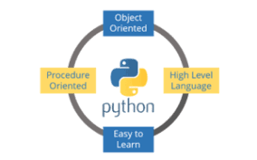

# Python Coding Basics
The purpose of this article is to demonstrate the basic coding in Python Programming Language. The code for the same is also provided in "code" folder.
## Outcomes
The reader will get well acquainted with the basic coding syntax of Python Programming Language.
### Example:
```python
print("Basic Coding: Python Programming Language")
```
#### Output:


## Table of Contents
#### [What is Python?](https://github.com/jimitshah77/Python-Basics/blob/master/README.md#what-is-python-1)
#### [Why Python](https://github.com/jimitshah77/Python-Basics/blob/master/README.md#why-python-1)
### [Basic Codes](https://github.com/jimitshah77/Python-Basics/blob/master/README.md#basic-codes-1)
#### [1)print()](https://github.com/jimitshah77/Python-Basics/blob/master/README.md#1print-1)
#### [2)Assignment Operator]()


---

### What is Python?


### Why Python?


***

## Basic Codes:

### 1)print()
```python
print("Basic Coding: Python Programming Language")
```
#### Output:


### 2)Assignment Operator
```python
# We use "=" for assignment of one value to the variable
a= 10
print("The value of a is "+str(a))
# NOTE: We have to convert int to string for maintaining same type in print statement


# We can also assign multiple variable at a time
b,c=20,30
print("The value of b & c is "+str(b)+"&"+str(c))

#We can also assign value of one variable to another variable
d=a
print("The value of d is "+str(d))
```
#### Output:


