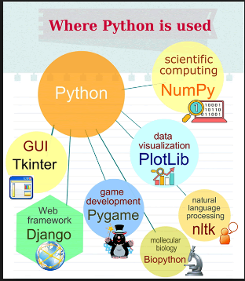

# Python Coding Basics
The purpose of this article is to demonstrate the basic coding in Python Programming Language. The code for the same is also provided in "code" folder.
## Outcomes
The reader will get well acquainted with the basic coding syntax of Python Programming Language.
### Example:
```python
print("Basic Coding: Python Programming Language")
```
#### Output:


## Table of Contents
#### [What is Python?](What-is-Python?)
#### Why Python
### Basic Codes
#### 1)print()
#### 2)Assignment Operator

---
<a name="What-is-Python?"/>
### What is Python?


### Why Python?


## Basic Codes:

### 1)print()
```python
print("Basic Coding: Python Programming Language")
```
#### Output:


